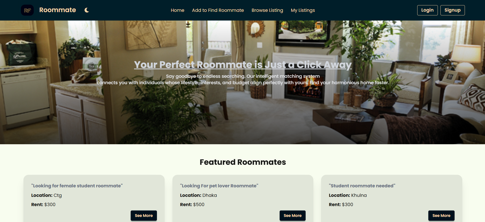

# 🏠 Roommate Finder

**Live Site URL:** [https://roommate-finder-website-f7f07.web.app/](https://roommate-finder-website-f7f07.web.app/)

---

## 📌 Project Overview

Roommate Finder is a full-stack web platform designed to help individuals find compatible roommates based on location, budget, lifestyle preferences, and interests. Users can create profiles, browse listings, post roommate find ads, and connect through a seamless and secure user experience.

The app features Firebase Authentication for user management, MongoDB for data storage, and a clean, responsive UI built with React, Tailwind CSS, and DaisyUI.

---

## 🖼 Screenshot

*(Add a screenshot to your project’s `public` folder named `screenshot.png` to display it here.)*

---

## 🧰 Main Technologies Used

- **Frontend:** React (latest), Vite
- **Styling:** Tailwind CSS, DaisyUI
- **Backend:** Node.js, Express.js
- **Database:** MongoDB Atlas
- **Authentication:** Firebase Authentication (Email/Password & Google)
- **Others:** React Router v7, React Toastify, SweetAlert2, Lottie React, React Tooltip

---

## ✨ Core Features

- Secure user registration and login with Firebase Authentication
- Post roommate find listings with details: rent, room type, lifestyle preferences, and contact info
- Browse and search roommate listings dynamically fetched from MongoDB
- View detailed listing pages with like functionality and contact reveal upon liking
- Users can like any listing multiple times except their own posts
- Protected private routes for adding, updating, and managing listings
- Update and delete listings with confirmation modals
- Responsive design for mobile, tablet, and desktop screens
- Dark/Light theme toggle using DaisyUI
- Loading spinners during data fetches
- Meaningful toast and alert messages for actions and errors

---

## 📦 Key Dependencies

- react
- react-router
- tailwindcss
- daisyui
- firebase
- react-toastify
- sweetalert2
- lottie-react
- react-tooltip
- axios
- express (server)
- cors (server)
- dotenv (server)
- jsonwebtoken (server)

---

